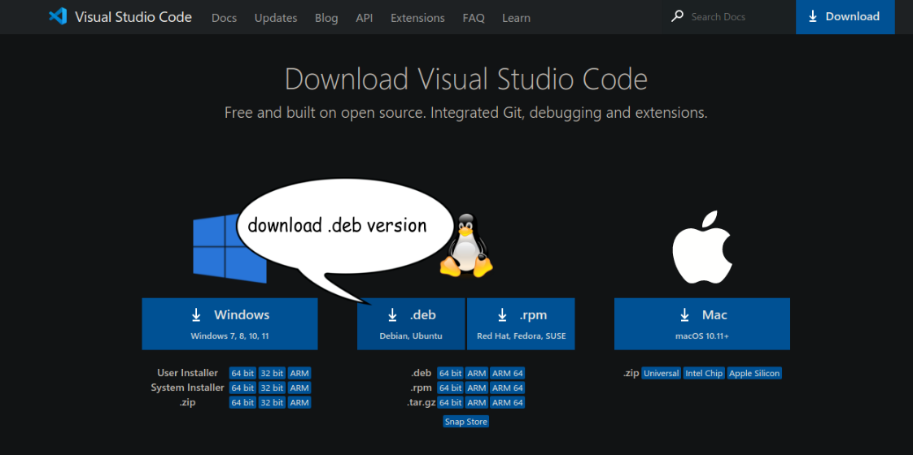
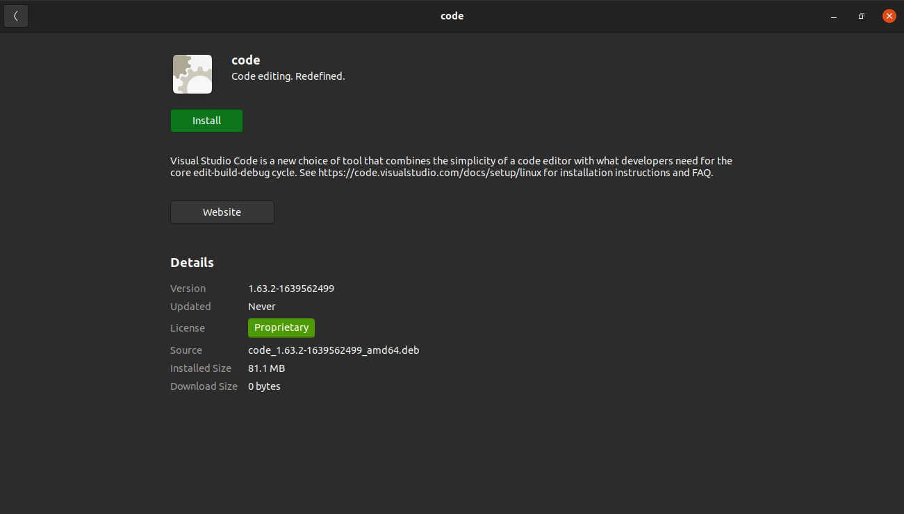

# Visual studio code (VSCode)

Visual Studio Code is a code editor with support for development operations like debugging, task running, and version control.

steps fot installing vscode:

- download the vscode from this link: [vscode](https://code.visualstudio.com/Download)

<!--  -->


- after that open the file and click on the install button.

<!--  -->


- restart your terminal and type this command:

```bash
code -v

// you should see the version of vscode that you have installed. like this:

1.63.2
899d46d82c4c95423fb7e10e68eba52050e30ba3
x64
```

- in order to run the VSCode using ubuntu, we need to create a Demo project for testing.

## To create a project follow these steps:

- from your UBUNTU run these commands:

```
mkdir Demo
cd Demo
```

then

```
code .
```

- when you hit `code .` you should see downloading... then your `VSCode` should be opened inside your current directory
- Note: if you see a `TRUST PROJECT` message please always click trust.

## important extensions for vscode:

- `markdownlint`
- `ESLint`
- `live server`
- `html preview`

## recommended extensions for vscode:

- `code spell checker`
- `color Highlights`
- `Rainbow Brackets`
- `image Preview`

### [❮ Back](./node-installation.md)
